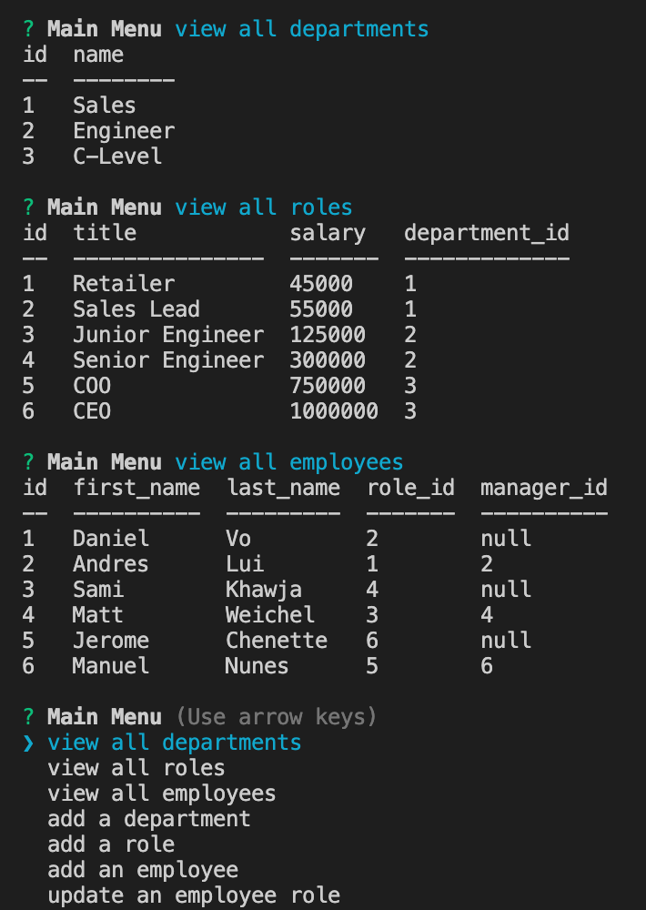

# Employee Tracker

<!-- TABLE OF CONTENTS -->
<details open="open">
  <summary>Table of Contents</summary>
  <ol>
    <li>
      <a href="#about-the-project">About The Project</a>
      <ul>
        <li><a href="#built-with">Built With</a></li>
      </ul>
    </li>
    <li>
      <a href="#getting-started">Getting Started</a>
    </li>
    <li><a href="#code-snippet">Code Snippet</a></li>
    <li><a href="#license">License</a></li>
    <li><a href="#contact">Contact</a></li>
    <li><a href="#acknowledgements">Acknowledgements</a></li>
  </ol>
</details>


<!-- ABOUT THE PROJECT -->
## About The Project



For this application, I had to create an employee tracker application. The user will be able to see tables of the different departments, roles and employees while also being able to add departments, roles and employees and updating employees. Per usual, this tested my knowledge with node.js and made me do a bunch of research to deliver the best application to the user. Of course, this was a fun to make and quite the challenge!

The websites I used to help create the application are listed below in the <a href="#acknowledgements">acknowledgements</a>.

### Built With

I used <a href="https://code.visualstudio.com/">Visual Studio Code</a> to create this application.


<!-- GETTING STARTED -->
## Getting Started

To get started, use the following commands in your terminal:

From the root of the file directory, use the following command:
```
node server.js
```


<!-- USAGE EXAMPLES -->
## Code Snippets

Below is a then statement I had to use in order to add or update depending on what the user chose. I had multiple then statements and at times it was confusing because in was template literal while adding what was selected and everything had to be perfect. I also added the the table so when the user adds or updates, they can see the changes right away!
```
.then((select) => {
  db.query(`INSERT INTO employees (first_name, last_name, role_id, manager_id) VALUES ("${select.employeeFirst}", "${select.employeeLast}", ${select.employeeRole}, ${select.employeeManager});`, (err, res) => {
    console.log("Employee is updated to the database");
    viewEmployees();
})
```


<!-- LICENSE -->
## License

Distributed under the MIT License. See `LICENSE` for more information.


<!-- CONTACT -->
## Contact
Sami Khawja: Skhawja11@gmail.com


## Project Links
Project Link: [GitHub](https://github.com/samikhawja/employee_tracker)


<!-- ACKNOWLEDGEMENTS -->
## Acknowledgements
* [W3Schools](https://www.w3schools.com/)
* [StackOverflow](https://stackoverflow.com/)
* [Mozilla](https://developer.mozilla.org/en-US/docs/Web/JavaScript)
* [JQuery](https://jquery.com/)